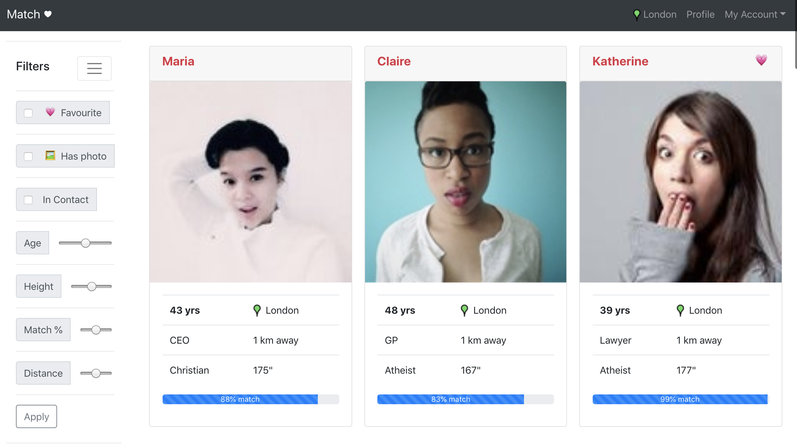

# Match

The application is live on Google cloud running as a serverless container app - [Knative](https://knative.dev/)

https://match-schkqdvd2a-ew.a.run.app/

###### Auto-scaled, down to 0, so very first request after being idle might take few seconds.


<div align="center">
    </img>
</div>

## Tools Choices
| Framework        | Description|
| ------------- |-------------|
| [MongoDB Altas](https://www.mongodb.com/cloud/atlas)    | MongoDB as SAAS running on AWS |
| [Spring Data MongoDB](https://docs.spring.io/spring-data/mongodb/docs/current/reference/html/#mongo.core)    | Spring data support for MongoDB |
| [Lombok](https://projectlombok.org/) | To avoid repeating boiler plate getter, settter, equals, hashcode in java |
| [MapStruct](https://mapstruct.org/) | MapStruct is a code generator that simplifies mappings between Java bean types |
| [flapdoodle](https://github.com/flapdoodle-oss/de.flapdoodle.embed.mongo) | Embedded MongoDB to simplify unit/integration tests |
| [React](https://reactjs.org/) | A JavaScript library for building user interfaces      |
| [reactstrap](https://reactstrap.github.io/) | React native Bootstrap 4 components      |
| [Create React App](https://github.com/facebook/create-react-app) | One Dependency that encapsulates all goodness of React, JSX, ES6, TypeScript, Webpack, Babel, ESLint     |
| [Jib](https://github.com/GoogleContainerTools/jib) | Jib is a Maven plugin for building Docker and OCI images of Java applications.|
| [Cloud Run](https://cloud.google.com/run) | Run stateless containers on a Google cloud      |
| [Knative](https://knative.dev/) | Google cloud uses this Kubernetes-based platform to deploy and manage modern serverless workloads.|
| [RandomUser](https://randomuser.me/photos) | A free, open-source API for generating random user data.|

## Project Setup

## Back-end
Spring boot app with MongoDB for persistence.

- [QueryBuilder](src/main/java/com/dating/matcher/service/QueryBuilder.java) Exposes fluent API that simplifies creation of Query
- [MatchService](src/main/java/com/dating/matcher/service/MatchService.java) Leverages MongoTemplate to achieve complex filter conditions with all possible combinations 

### Match filter requests
Supports all combinations of filters

```shell script
/matches/filter

/matches/filter?hasContact=1&hasPhoto=1&isFavourite=1

/matches/filter?ageTo=44&heightFrom=170&distance=2

/matches/filter?distance=2&isFavourite=0&heightFrom=165&heightTo=175 \
&ageFrom40&ageTo=50&csFrom=80&csTo=88&hasPhoto=1&hasContact=1
```

### Building
From root directory
```
mvn clean install

Run "MatcherApplication.java" from IDE or execute "./mvnw spring-boot:run" from terminal
```
And navigate to http://localhost:8080

#### Notes
-  During `mvn clean install` the `maven-resources-plugin` will copy static html/js/css build files generated from ./gui/build to target/static/
 to serve as a "Single Page APP" within a webserver [Spring boot's tomcat in this case].

 - So there is no need to run separate web-server for fron-end.
 But it is still possible to run both independently.
 
 - Add @Profile("saveSampleMatches") to persist sample records from *matches.json* file
 
 - The images for the profiles from [randomuser](https://randomuser.me/) for better GUI experience

## Front-end
ReactsJs based web-app with bootstrap responsive design.

### Building

`./web` from the root directory contains all the GUI related files which itself is a functional create-react-app project.
```
cd ./web

npm install --save  ==> Downloads all node modules locally, will take ~10 mins if first time

npm start ==> Starts a webserver at localhost:3000 and points localhost:8080 for back-end queries

npm run build ==> Generates static production files under /build
```

## Deployment
### Local
Execute the utility script that builds docker images locally.
```shell script
./build-image.sh
```
### Google Cloud
Execute the utility script that builds docker images for Google europe docker registry.
```shell script
./build-image-gcloud.sh
```

#### Mongo query
```json
{
  "query": {
    "$and": [
      {
        "age": {
          "$lte": 50
        }
      },
      {
        "compatibilityScore": {
          "$gte": 0.800000011920929,
          "$lte": 0.8799999952316284
        }
      },
      {
        "contactsExchanged": {
          "$gt": 0
        }
      },
      {
        "favourite": false
      },
      {
        "height": {
          "$gte": 165,
          "$lte": 175
        }
      },
      {
        "mainPhoto": {
          "$exists": true
        }
      }
    ]
  },
  "maxDistance": 3.135711885774796E-4,
  "distanceMultiplier": 6378.137,
  "near": [
    51.5071576,
    -0.1275761
  ],
  "spherical": true
}
```